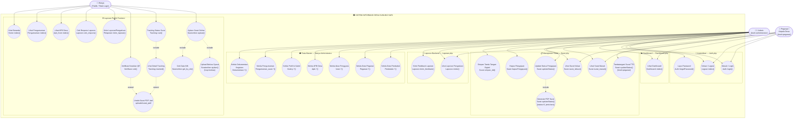

```mermaid
graph TB
    %% ===== AKTOR =====
    Admin(["🧑‍💼 Admin\n(level=administrator)"])
    Pegawai(["👔 Pegawai /\nKepala Desa\n(level=pegawai)"])
    Warga(["👥 Warga\n(Publik / Tidak Login)"])

    %% ===== SISTEM BATAS =====
    subgraph SISTEM ["🏛️  SISTEM INFORMASI DESA GUNUNG SARI"]

        subgraph AUTH ["🔐 Autentikasi  — Auth.php"]
            UC_Login(("Masuk / Login\nAuth::login()"))
            UC_Logout(("Keluar / Logout\nLogout::index()"))
            UC_ForgotPass(("Lupa Password\nAuth::forgotPassword()"))
        end

        subgraph DASHBOARD ["📊 Dashboard  — Dashboard.php"]
            UC_Dashboard(("Lihat Dashboard\nDashboard::index()"))
        end

        subgraph SURAT_ADMIN ["📋 Manajemen Surat  — Surat.php"]
            UC_SuratMasuk(("Lihat Surat Masuk\nSurat::surat_masuk()"))
            UC_UpdateStatus(("Update Status Pengajuan\nSurat::updateStatus()"))
            UC_TTDSurat(("Tandatangani Surat TTD\nSurat::updateStatus()\n[level=pegawai]"))
            UC_GeneratePDF(("Generate PDF Surat\nSurat::updateStatus()\n[status=5, jenis baru]"))
            UC_SuratKeluar(("Lihat Surat Keluar\nSurat::surat_keluar()"))
            UC_HapusPengajuan(("Hapus Pengajuan\nSurat::hapusPengajuan()"))
            UC_SimpanTTD(("Simpan Tanda Tangan Digital\nSurat::simpan_ttd()"))
        end

        subgraph MASTER_DATA ["🗃️ Data Master  — Hanya Administrator"]
            UC_Penduduk(("Kelola Data Penduduk\nPenduduk::*()"))
            UC_Pegawai(("Kelola Data Pegawai\nPegawai::*()"))
            UC_User(("Kelola Akun Pengguna\nUser::*()"))
            UC_APB(("Kelola APB Desa\nApb::*()"))
            UC_Galeri(("Kelola Profil & Galeri\nGalery::*()"))
            UC_Pengumuman(("Kelola Pengumuman\nPengumuman_surat::*()"))
            UC_Dokumentasi(("Kelola Dokumentasi\nKegiatan\nDokumentasi::*()"))
        end

        subgraph LAPORAN_ADMIN ["📢 Laporan Backend  — Laporan.php"]
            UC_LihatLaporan(("Lihat Laporan Pengaduan\nLaporan::index()"))
            UC_FeedbackLaporan(("Kirim Feedback Laporan\nLaporan::kirim_feedback()"))
        end

        subgraph WARGA_PUBLIK ["🌐 Layanan Publik Frontend"]
            UC_AjukanSurat(("Ajukan Surat Online\nSuratonline::ajukan()"))
            UC_UploadBerkas(("Upload Berkas Syarat\nSuratonline::ajukan()\n[loop berkas]"))
            UC_CekNIK(("Cek Data NIK\nSuratonline::get_by_nik()"))
            UC_Tracking(("Tracking Status Surat\nTracking::cari()"))
            UC_DetailTracking(("Lihat Detail Tracking\nTracking::tracked()"))
            UC_VerifikasiQR(("Verifikasi Keaslian QR\nVerifikasi::cek()"))
            UC_UnduhSurat(("Unduh Surat PDF Jadi\nuploads/surat_jadi/"))
            UC_KirimLaporan(("Kirim Laporan/Pengaduan\nPelaporan::kirim_laporan()"))
            UC_CekRespons(("Cek Respons Laporan\nLaporan::cek_respons()"))
            UC_LihatAPBFront(("Lihat APB Desa\nApb_front::index()"))
            UC_LihatPengumuman(("Lihat Pengumuman\nPengumuman::index()"))
            UC_Beranda(("Lihat Beranda\nHome::index()"))
        end

    end

    %% ===== ASOSIASI ADMIN =====
    Admin --> UC_Login
    Admin --> UC_Logout
    Admin --> UC_ForgotPass
    Admin --> UC_Dashboard
    Admin --> UC_SuratMasuk
    Admin --> UC_UpdateStatus
    Admin --> UC_SuratKeluar
    Admin --> UC_HapusPengajuan
    Admin --> UC_SimpanTTD
    Admin --> UC_LihatLaporan
    Admin --> UC_FeedbackLaporan
    Admin --> UC_Penduduk
    Admin --> UC_Pegawai
    Admin --> UC_User
    Admin --> UC_APB
    Admin --> UC_Galeri
    Admin --> UC_Pengumuman
    Admin --> UC_Dokumentasi

    %% ===== ASOSIASI PEGAWAI =====
    Pegawai --> UC_Login
    Pegawai --> UC_Logout
    Pegawai --> UC_Dashboard
    Pegawai --> UC_SuratMasuk
    Pegawai --> UC_TTDSurat
    Pegawai --> UC_SuratKeluar
    Pegawai --> UC_LihatLaporan

    %% ===== ASOSIASI WARGA =====
    Warga --> UC_AjukanSurat
    Warga --> UC_Tracking
    Warga --> UC_VerifikasiQR
    Warga --> UC_KirimLaporan
    Warga --> UC_CekRespons
    Warga --> UC_LihatAPBFront
    Warga --> UC_LihatPengumuman
    Warga --> UC_Beranda

    %% ===== RELASI INCLUDE =====
    UC_AjukanSurat -. "include" .-> UC_UploadBerkas
    UC_AjukanSurat -. "include" .-> UC_CekNIK
    UC_Tracking -. "include" .-> UC_DetailTracking
    UC_UpdateStatus -. "include" .-> UC_GeneratePDF

    %% ===== RELASI EXTEND =====
    UC_DetailTracking -. "extend" .-> UC_UnduhSurat
    UC_VerifikasiQR -. "extend" .-> UC_UnduhSurat
```
